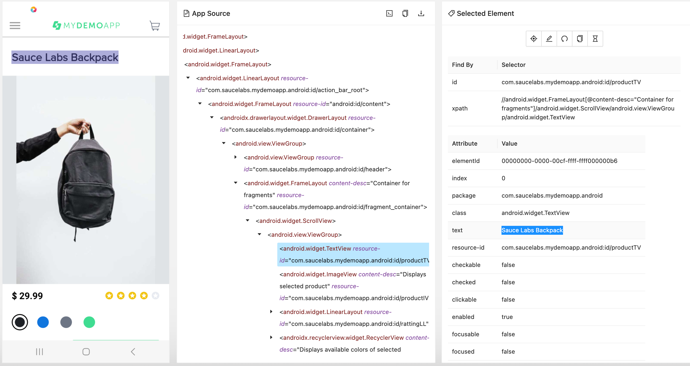
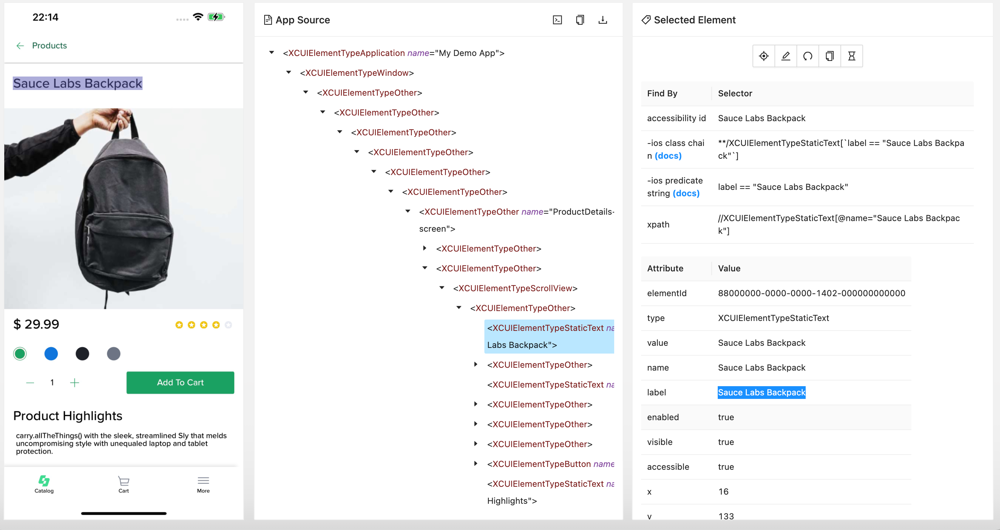

# Mobile testing w/ Appium + Java

Mobile automated testing using Appium and Java.    
Cross-platform mobile automation using Page Object Model (POM) with AppiumFieldDecorator
---
## Once upon a time…    
On March 28, 2023, I participated in “Advanced Appium 2.0” workshop that was part of the SeleniumConf in Chicago.   
This workshop was led by Sai Krishna and Srinivasan Sekar.    
It was a great workshop, and I learned a lot from it.    
One of the topics in this workshop was about how to run the same test for a native app on both Android and iOS OS (Operating System).   
Sai and Srinivasan shared these repositories that helped me to develop this framework:
[AppiumTestDistribution](https://github.com/AppiumTestDistribution/AppiumTestDistribution) and    
[PageObjectPatternAppium](https://github.com/AppiumTestDistribution/PageObjectPatternAppium)

### The main challenges

The main challenges to run the same test on Android and iOS OS are:
1.	<b>Selectors</b>    
Selectors (or locators) are essentially mechanisms used to identify and interact with elements within a mobile application's user interface. They help the test scripts locate buttons, text fields, checkboxes, and other interactive components to simulate user interactions accurately.
      However, Android and iOS applications are built using distinct UI frameworks and guidelines, leading to variations in how elements are represented in the UI hierarchy.    
      Here is an example for the same native app page and how the App source looks like in Android:
          
      and in iOS
      
2. <b>Divergent Business Flows between Android and iOS</b>   
   Developing Appium tests to be executed on both Android and iOS platforms introduces another significant challenge: the potential variance in business flows or user interactions between the two operating systems. This difference arises from the reality that many organizations maintain separate teams for Android and iOS development, leading to platform-specific design and user experience considerations.

### The solutions
1. <b>Selectors</b>    
   I use cross-platform mobile automation using Page Object Model (POM) with AppiumFieldDecorator.
   In Appium, `@iOSXCUITFindBy` and `@AndroidFindBy` are annotations provided by the PageFactory class to help you define locators for both iOS and Android platforms using a single set of code. This allows you to write more portable and maintainable automation scripts by using the same page object model for both platforms.
   The AppiumFieldDecorator is used to enhance the Page Object Model with Appium's specific features and allows you to combine Appium's functionality with the conventional POM structure. Example:

```bash
@iOSXCUITFindBy(accessibility = "Products")
@AndroidFindBy(id = "com.saucelabs.mydemoapp.android:id/productTV")
public WebElement productsTitle;
```

2. <b>Divergent Business Flows between Android and iOS</b>    
   Sometime during run time, we need to perform a different approach depend if we run on Android device or iOS device.
   We can do that by checking the “platformName” in the capabilities:
```bash
platformName = driver.getCapabilities().getPlatformName().toString().toLowerCase();
```

And 
```bash
public boolean isAndroid(){
    return platformName.toLowerCase().equals("android");
}
```
In the example below we need to get the text of the product title.  For Android, the value is in the text attribute and in iOS the value is in the “value” attribute.
```bash
public String getProductTitle(){
logger.info("Sauce - getProductTitle");
if (isAndroid())
return productDetailsPageObjects.productTitle.getText();
else
return productDetailsPageObjects.productTitle.getAttribute("value");
}
```

---
## Setup  

### Sauce Labs setup
1. Free [Sauce account](https://saucelabs.com/sign-up)
2. Make sure you know how to find your Sauce Labs Username and Access Key by going to the [Sauce Labs user settings page](https://app.saucelabs.com/user-settings)

---
### Appium setup
1. We will run our automated tests on Sauce Labs devices; therefore, there is no need to install Appium Server.

---
### Demo app(s)   

1. The Android demo apps that has been used for the Android tests can be found [here](https://github.com/saucelabs/my-demo-app-android/releases).
2. The iOS demo apps that has been used for the iOS tests can be found [here](https://github.com/saucelabs/my-demo-app-ios/releases).   
Be aware of the fact that and iOS simulator uses a different build then a iOS real device. So please check the file you
download.

> The advice is to download the files to an `apps` folder in the root of this folder.

Make sure that when you downloaded the files from the releases page, that you rename the apps to the following:

- `mda-{#.#.#-#}.apk` => `my-demo-app-android.apk`
- `SauceLabs-Demo-App.ipa` => `SauceLabs-Demo-App.ipa`
- `Saucelabs-demo-app.simulator.zip` => `SauceLabs-Demo-App.Simulator.zip`

**If you don't do that then the scripts can't find the apps!**

#### Upload apps to Sauce Storage
If you want to use Android emulators, Android real devices, iOS simulators or iOS real devices in the Sauce Labs platform, you need to upload
the apps to the Sauce Storage.

#### Manual upload
Execute the following steps to manually upload the apps:
- Login to the Sauce Labs platform
- Go to **LIVE** > **Mobile App**
- Click on **App Upload** and OR select the folder, OR drag the apps to the screen to upload them

#### Automated upload
You can find a script to upload them to, OR the US, OR EU DC in [this](../../helpers/push_apps_to_storage.sh)-file. You can push the files to the
storage by doing the following from the folder `appium-app-examples`:

    cd src/test/java/sauce/demo/helpers/
    ./push_apps_to_storage.sh


## Extra resources

- [Appium options for sauce](https://docs.saucelabs.com/dev/test-configuration-options/#mobile-app-appium-capabilities-required)
- [All appium capabilities](https://appium.io/docs/en/writing-running-appium/caps/)
